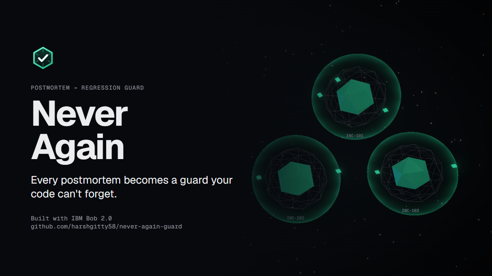
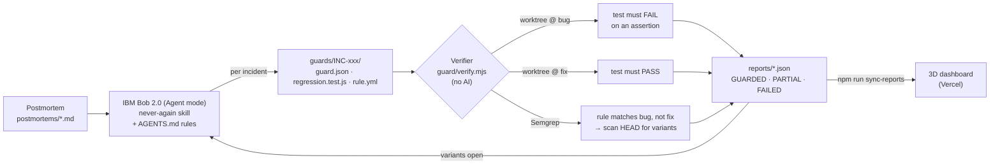

# Never Again — Postmortem → Regression Guard



**Every postmortem becomes a guard your code can't forget.**

Never Again turns an incident postmortem into a *proven* regression guard: a test that fails on the buggy commit and passes on the fix, a static rule that finds the same mistake elsewhere in the codebase, and an audit of which action items are actually done. It's built with IBM Bob 2.0.

**Bob generates. A deterministic verifier judges.** The AI never grades its own homework.

- **Live dashboard:** _<Vercel URL — add after deploy>_
- **Code:** https://github.com/harshgitty58/never-again-guard

---

## The problem

After an incident, the team writes a postmortem with action items like "add a test", "check for similar code" or "update the runbook". Those items sit in a document and quietly drift. Two gaps make the same incident likely to happen again:

1. **Nobody proves the new test would have caught the bug.** A test that passes today proves nothing if it would also have passed on the broken code.
2. **The root-cause pattern is rarely in just one file.** The same mistake is usually copy-pasted elsewhere, and no one goes looking for it.

## The solution

For each postmortem, Never Again produces:

| # | Output | How it's proven |
|---|---|---|
| 1 | **Regression test** (`guards/INC-xxx/regression.test.js`) | Must **fail on an assertion** at the bug commit and **pass** at the fix commit |
| 2 | **Variant rule** (`guards/INC-xxx/rule.yml`, Semgrep) | Must match the original bug, must not match the fix, then scans the whole app |
| 3 | **Variant fixes** | The verifier reruns until no variants are open |
| 4 | **Action-item audit** | Every item is marked `guarded / partial / unguarded / process-only`, with file evidence |
| 5 | **Verdict** | `GUARDED / PARTIAL / FAILED`, written to `reports/INC-xxx.json` and shown on the dashboard |

## Results (from `reports/`, not hand-written)

The demo app `shoplite/` is a small Express shop with three incidents modeled on real-world failures:

| Incident | Root cause | Bug proof (test @ bug commit) | Fix proof | Variants run 1 → run 2 | Verdict |
|---|---|---|---|---|---|
| **INC-101** Midnight orders got the wrong delivery date | UTC `getHours()` on a server whose customers are in IST | ✗ `expected '2026-09-27' to be '2026-09-28'` | ✓ | 3 → 0 | **GUARDED** |
| **INC-102** Retry storm took down the payment gateway | `withRetry(fn)` with no options, so infinite retries with 0 ms delay | ✗ `expected 10 to be less than or equal to 4` | ✓ | 2 → 0 | **GUARDED** |
| **INC-103** ₹NaN checkout | `item.price * qty` on a null price from the inventory API | ✗ `expected [Function] to throw an error` | ✓ | 2 → 0 | **GUARDED** |

- **7 hidden variants** were found by the rules in run 1 (`reports/history/run-1/`). All 7 were fixed and proven closed in run 2 (`reports/history/run-2/`).
- **11 of 11 code action items** have file evidence, up from 6 of 11 in run 1. **4 are process-only** (runbooks, CI policy, docs) and are labeled that way rather than given invented code evidence.
- **Full verifier run: under a minute** for all three incidents (40–46 s on our machines: worktrees, 6 test runs, 9 Semgrep scans), also on a fresh clone.

## How it works



The verifier (`guard/verify.mjs`, zero production dependencies) does this for each `guards/*/guard.json`:

1. **Anti-cheat** the test: it must call `expect()`, must not use `.skip/.todo/.only`, must not mock the module under test, and must not import other guards.
2. Check out `bugRef` in a throwaway git worktree, run the test, and **require an assertion failure**. A crash or import error doesn't count.
3. Check out `fixRef`, run the test, and **require a pass**.
4. Run the rule at `bugRef` and require it to **match the seed** (file:line ±2).
5. Run the rule at `fixRef` and require the seed to be **clean**.
6. Run the rule on `HEAD` and **collect variants**.
7. Check that every evidence path exists, assign the verdict, clean up the worktrees, and write `reports/INC-xxx.json`.

It exits `0` only if **every** incident is `GUARDED`.

## Quickstart

Requirements: Node ≥ 20, git, and [Semgrep](https://semgrep.dev/docs/getting-started/) (`pip install semgrep`).

```bash
git clone https://github.com/harshgitty58/never-again-guard.git
cd never-again-guard
npm install --prefix shoplite

npm run test:app          # shoplite's own tests
npm run guard -- --all    # verify all incidents (or: npm run guard -- INC-102)
```

View the dashboard locally:

```bash
npm run sync-reports      # copies reports/ into dashboard/public/reports + extracts code snippets
cd dashboard && npm install && npm run dev
```

## IBM Bob 2.0 usage

| Bob feature | Where |
|---|---|
Bob did the core build in one long Agent-mode task, driven by `plan.md` and the project rules in `AGENTS.md`, working through its own 12-step to-do list (39.26 Bobcoins).

| What Bob did | Where |
|---|---|
| Built the demo app with real incident history | `shoplite/`, git tags `inc-10x-bug` / `inc-10x-fix` |
| Wrote the three postmortems | `postmortems/` |
| Wrote the verifier CLI (worktrees, Vitest/Semgrep runners, anti-cheat, reports) | `guard/` |
| Read each postmortem (document understanding) and wrote its guard | `guards/INC-xxx/`: `guard.json`, `regression.test.js`, `rule.yml` |
| Ran the verifier: 3 PARTIAL, 7 open variants | `reports/history/run-1/` |
| Fixed all 7 variants and reran: 3 GUARDED, 0 open | `shoplite/src/`, `reports/history/run-2/` |
| Created the reusable skill | `.bob/skills/never-again/SKILL.md` |
| Debugged Semgrep launching on Windows | `guard/lib/run-rule.mjs` |

Guardrails Bob worked under (`AGENTS.md`): never edit app source while writing a guard, quote the verifier's real verdict, fix the guard rather than the app, and classify process-only action items honestly.

Task session screenshots are in [`bob_sessions/`](bob_sessions/).

## Repo layout

```
shoplite/        demo app (Express, Vitest), git tags inc-10x-bug / inc-10x-fix
postmortems/     INC-101/102/103 postmortems
guards/INC-xxx/  guard.json · regression.test.js · rule.yml
guard/           verifier CLI (verify.mjs + lib/)
reports/         verifier output; history/run-1 (before) and run-2 (after)
dashboard/       Vite + React + TypeScript + react-three-fiber; reads public/reports only
.bob/            never-again skill + templates
docs/            architecture + submission material
```

## License

[MIT](LICENSE)
